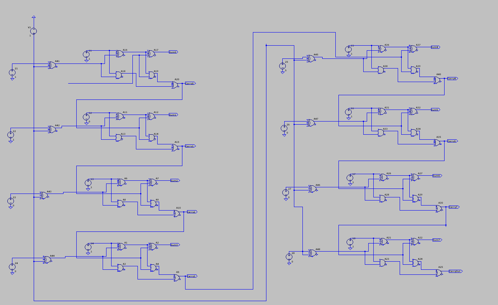
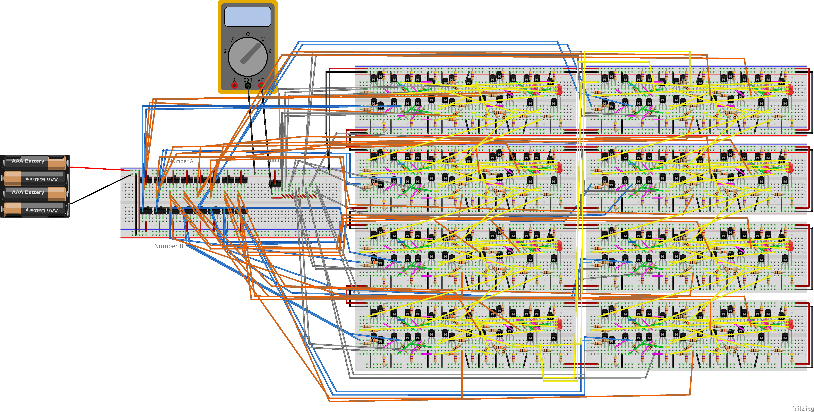
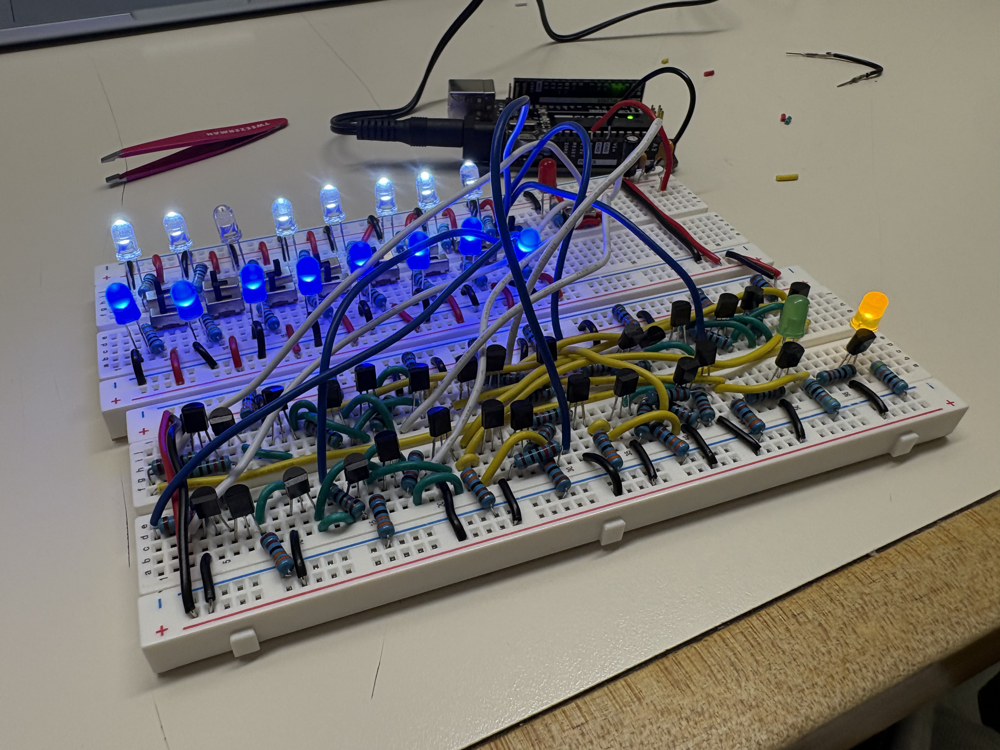

# Building an 8-Bit CPU from Transistors

I have used computers for most of my life, but for a long time the processor itself was basically a black box to me. I knew that code eventually became electrical signals, but I did not understand how a group of transistors could add numbers, remember data, or follow instructions. I started this project because I wanted to work through that entire path myself instead of only reading about it.

The long-term goal is still a complete 8-bit CPU. I originally tried to plan everything at once—the ALU, registers, program counter, control unit, clock, and memory interface—but I quickly realized that physically building all of that from discrete transistors would be a huge jump. I decided to make the first hardware milestone an **8-bit adder/subtractor**, since it is both manageable and something I can later reuse inside the ALU.

## Where I am right now

I started in LTspice, where I could build a gate, simulate it, and check its output before connecting it to anything else. From there, I combined gates into half adders and full adders and tested an 8-bit ripple-carry design. Simulation gave me a working plan, but transferring that plan onto a breadboard has been a completely different challenge.

I am currently building and testing the first 1-bit stage with 2N3904 NPN transistors. The three inputs are A, B, and a SUB/Cin input, and the two outputs are SUM and carry-out. I am powering the breadboard from an Arduino's 5 V pin while I test it.

The biggest difference from LTspice is that the real circuit does not tell me where I made a mistake. I have had to learn how the breadboard rows connect, check transistor orientation, test the input switches, and trace signals with a multimeter one node at a time. Even the output LEDs caused confusion.

## Project images

### LTspice design

### Breadboard CAD

### Physical build

## The active-low LED problem

During one test, I set `A = 1`, `B = 1`, and `Cin = 0`. I expected `SUM = 0` and `Cout = 1`, but the yellow SUM LED turned on while the green carry LED turned off. At first, I thought the full adder was producing the exact opposite of the correct answer.

After measuring the output transistor, I found that the carry collector was at 5 V while its base and emitter were at 0 V. The carry signal was actually correct. The confusing part was how I had connected the LEDs: each LED runs from 5 V through a 450 Ω resistor to an NPN collector. When the collector is LOW, the transistor sinks current and the LED turns on. When the collector is HIGH, both sides of the LED are near 5 V, so it turns off.

That means my current indicators are **active-low**:

- LED on = output `0`
- LED off = output `1`

Once I interpreted the LEDs correctly, the results followed the full-adder truth table. I added a 10 kΩ pull-up resistor to the carry collector so that its HIGH output reached 5 V instead of floating around 2.7 V. I still need to decide whether to keep the indicators active-low or spend an extra transistor and resistor on each output to make LED-on mean 1. For now, I am leaning toward keeping them active-low because the collector voltage itself is correct.

This was a useful debugging lesson because the circuit was not broken in the way I first assumed. I had to stop judging the output only by whether an LED was lit and measure the actual voltage instead.

## How addition and subtraction share one circuit

The finished 8-bit circuit will use eight full-adder stages connected in a ripple-carry arrangement. Each stage receives two data bits and the carry from the previous stage, then produces one result bit and a new carry.

For subtraction, the SUB input changes how operand B enters the adder. When `SUB = 1`, each B bit is inverted and the first carry-in is also set to 1. The adder therefore calculates:

`A + B̅ + 1 = A - B`

I originally expected subtraction to require a separate circuit, so learning that the same chain of full adders can perform both operations was one of the ideas that made me want to build this physically.

## Next steps

My immediate goal is to make the 1-bit stage reliable enough that I can duplicate it without copying an unnoticed wiring problem. After that, I will:

1. Build the remaining seven stages.
2. Connect each carry-out to the next carry-in.
3. Test addition with small values before moving to all eight bits.
4. Test subtraction and verify the two's-complement behavior.
5. Measure voltage levels between stages and check whether fan-out causes any problems.
6. Use the completed adder/subtractor as the arithmetic starting point for the ALU.

The later CPU stages are still plans, and I expect the design to change as I learn more from the physical build. Eventually, I want to add the remaining ALU operations, registers, a program counter, an instruction register, a control unit, a clock, and a memory interface.

## Planned ALU operations

| Opcode | Operation |
|:---:|---|
| `000` | Addition |
| `001` | Subtraction |
| `010` | Bitwise AND |
| `011` | Bitwise OR |
| `100` | Bitwise XOR |
| `101` | Bitwise NOT |
| `110` | Shift left |
| `111` | Shift right |

## Repository contents

- `ltspice/` contains my simulations for gates, adders, registers, and other CPU circuits.
- `cad/` contains the breadboard layout for the adder/subtractor.
- `docs/` contains schematics, architecture notes, screenshots, and hardware pictures.
- `journals/` records what I worked on, what failed, and what I changed.
- `parts-list/` tracks the components and cost of the physical build.

I am documenting the mistakes along with the finished circuits because being able to explain why something failed is part of understanding how it works. By the end of the project, I do not just want a processor that produces the right outputs. I want to know what every major section is doing and why it is connected the way it is.

## Author

**Goodwin Chen**  
Summer 2026
